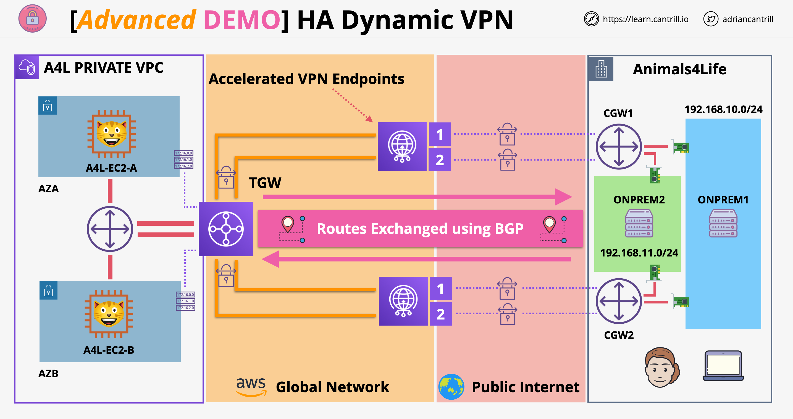

# Site-to-Site VPN

This project implements a **Dynamic, BGP-based, Highly Available Site-to-Site VPN** to simulate a **hybrid AWS and on-premises environment**—both hosted within AWS.

The implementation is inspired by **Adrian Cantrill's** training materials . For more details, visit:  
🔗 [Learn with Cantrill](https://learn.cantrill.io/)

## Project Overview

The project is structured into **five stages**, each progressively building upon the architecture:

1. **Provision the Environments** – Set up AWS infrastructure for both on-premises and cloud environments.
2. **TGW VPN Attachments** – Establish VPN attachments to AWS Transit Gateway.
3. **IPSec Tunnel Configuration** – Configure IPsec tunnels for secure communication.
4. **BGP Routing and Testing** – Implement BGP routing and validate connectivity.
5. **Cleanup** – Remove resources to avoid unnecessary costs.

This project demonstrates how to set up a resilient **site-to-site VPN** using **AWS services** and **BGP routing**, ensuring high availability and dynamic routing capabilities.

